# Top 27 Best Shapewear Brands in 2025 (Latest Updated)

Looking for shapewear that actually works without making you feel like you're trapped in a medieval torture device? Whether you need something for everyday smoothing under your favorite jeans, firm compression for a special event, or just want to feel more confident in form-fitting dresses, the right body shaping garment can make all the difference. Modern shapewear has come a long way from restrictive girdles—today's options blend comfort with functionality, offering everything from light tummy control to full-body sculpting that you can wear all day without counting down the minutes until you can take it off.

## **[SPANX](https://spanx.com)**

The brand that literally invented modern shapewear and made it a household name.

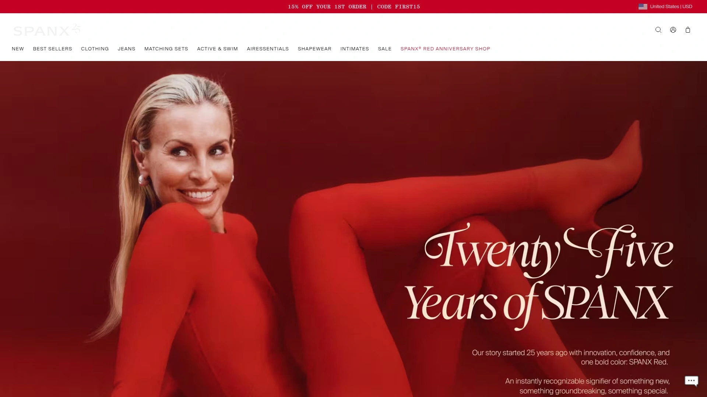

SPANX revolutionized the intimate apparel industry when it launched, transforming uncomfortable foundation garments into sleek, functional pieces women actually wanted to wear. The brand offers an extensive range including bodysuits, high-waisted shorts, shaping leggings with Booty Boost technology, and seamless invisible pieces designed to disappear under any outfit. Their signature AirEssentials collection combines compression with breathability, while the SPANXshape line features targeted mid-tummy compression and moisture-wicking SecretSweat Tech for active lifestyles. From lightweight everyday shapers to firm control options for special occasions, SPANX provides comprehensive solutions for smoothing, lifting, and sculpting without sacrificing comfort. The brand has expanded beyond basic shapewear to include leggings, jeans, bras, and athleisurewear, all maintaining their commitment to innovative fabrics and functional design.

## **[Skims](https://skims.com)**

Kim Kardashian's body-positive brand delivering soft, inclusive shapewear for every body type.

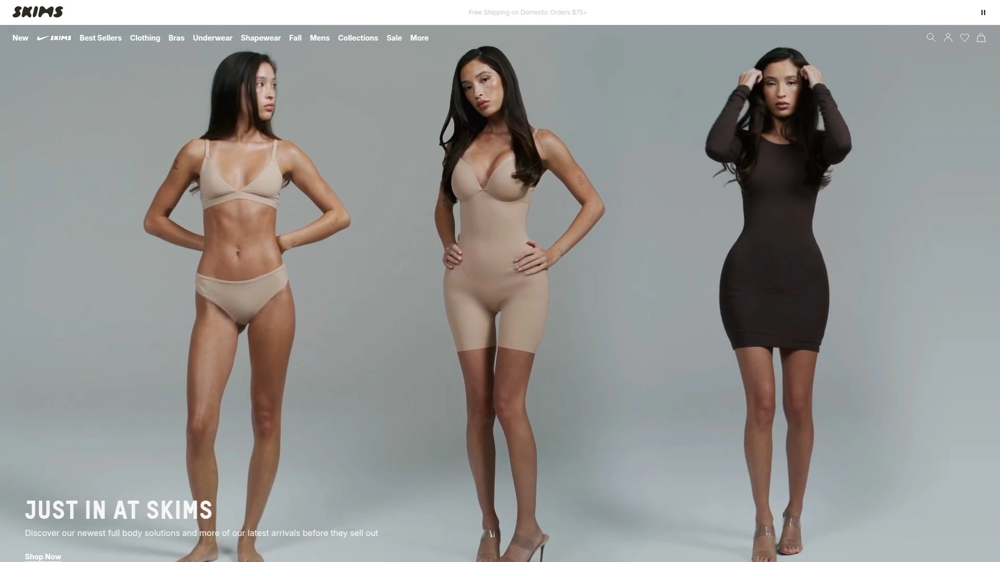

Skims has quickly become a favorite for its exceptionally soft fabrics and breathable designs that feel more like loungewear than traditional compression garments. The brand prioritizes inclusivity with an extensive size range and multiple nude shade options to match different skin tones. Their pieces offer gentle to moderate shaping that smooths without feeling restrictive, making them ideal for all-day wear. From seamless bodysuits to sculpting shorts and everyday basics, Skims focuses on comfort-first compression that adapts to your body rather than fighting against it.

## **[Honeylove](https://honeylove.com)**

Engineering-focused shapewear combining serious sculpting power with unexpected comfort.

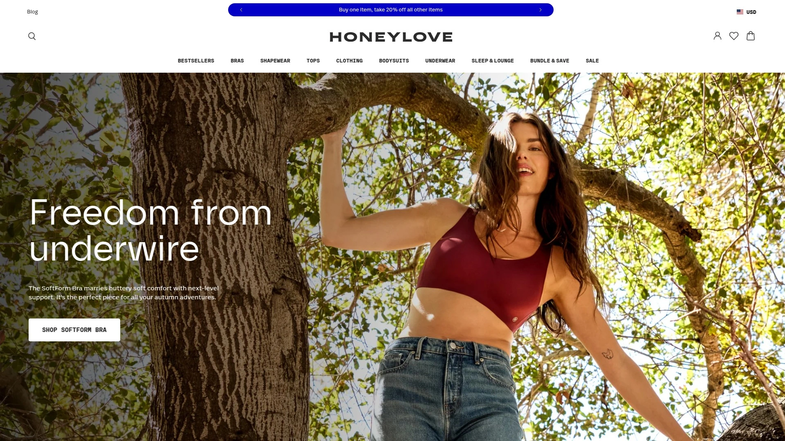

Honeylove stands out for its innovative construction that uses targeted panels and strategic compression zones instead of uniform squeeze. The brand's Liftwear Bra and SuperPower Short have earned devoted fans who appreciate how breathable the fabrics are compared to traditional shapewear. Their pieces utilize criss-cross compression technology to lift and shape while maintaining flexibility for movement. Honeylove delivers firm control without the suffocating feeling, making it possible to wear their bodysuits and shorts for extended periods.

## **[Yitty](https://yitty.com)**

Lizzo's bold, body-positive shapewear brand celebrating curves with vibrant colors and fashion-forward designs.

Yitty breaks away from traditional nude and black shapewear palettes, offering bright colors, unique textures, and playful prints meant to be seen rather than hidden. The brand champions body liberation with an extensive size range from XS to 6X, ensuring nearly everyone can find their fit. Designed for movement and versatility, Yitty pieces transition seamlessly from loungewear to activewear to outerwear. The brand emphasizes comfort and self-expression, encouraging wearers to embrace their bodies with joy and confidence rather than viewing shapewear as something to hide under clothes.

## **[Shapermint](https://shapermint.com)**

Affordable, accessible shapewear delivering quality smoothing without breaking the bank.

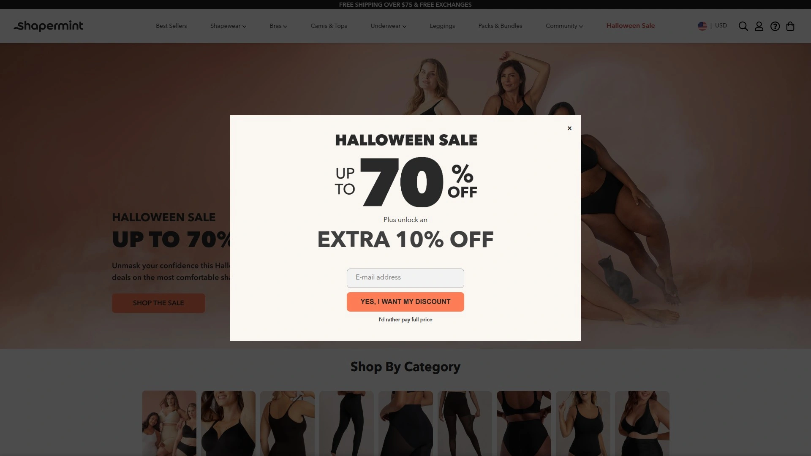

Shapermint has become an Amazon best-seller thanks to its combination of effective compression and reasonable pricing. Their Scoop Neck Compression Cami creates a flattering silhouette while staying put without rolling up, and it's comfortable enough to wear on its own or layered under clothes. Available in 14 colors including multiple nude shades and fun options, Shapermint pieces offer moderate shaping that works for everyday wear. The brand focuses on wearable compression that doesn't feel constricting, making it easier to incorporate shapewear into your daily routine.

## **[Commando](https://commando.com)**

Invisible, sleek shapewear engineered to completely disappear under even the most unforgiving fabrics.

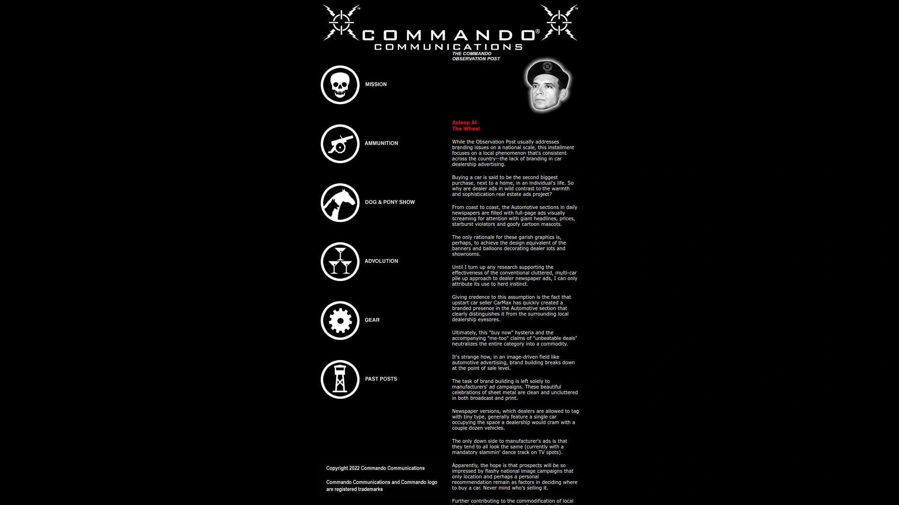

Commando specializes in seamless construction and raw-cut edges that create zero visible lines under clothing. Their pieces are perfect for special occasions when you need serious smoothing but can't risk any show-through with fitted dresses or clingy materials. The brand uses premium Italian fabrics that feel luxurious against skin while delivering firm, targeted control. Commando's minimalist approach prioritizes function and invisibility, making them a go-to choice for formal events and body-conscious outfits.

## **[Knix](https://knix.com)**

Innovative shapewear featuring leakproof technology and postpartum-friendly designs.

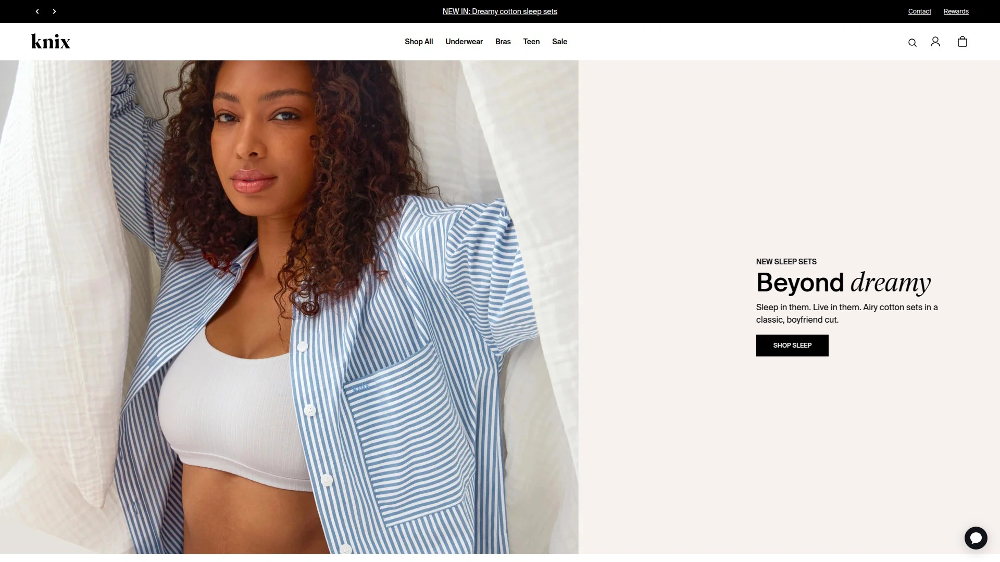

Knix combines body shaping with practical functionality, offering compression undergarments that also provide period and bladder leak protection. Their shapewear adapts to changing bodies, making them particularly popular for postpartum recovery and everyday confidence. The brand uses breathable, moisture-wicking fabrics that keep you comfortable throughout the day while providing smooth, supportive compression. Knix pieces work hard behind the scenes with bold designs that reflect their body-positive philosophy.

## **[Wacoal](https://wacoal-america.com)**

Heritage lingerie brand bringing decades of expertise to supportive, well-constructed shapewear.

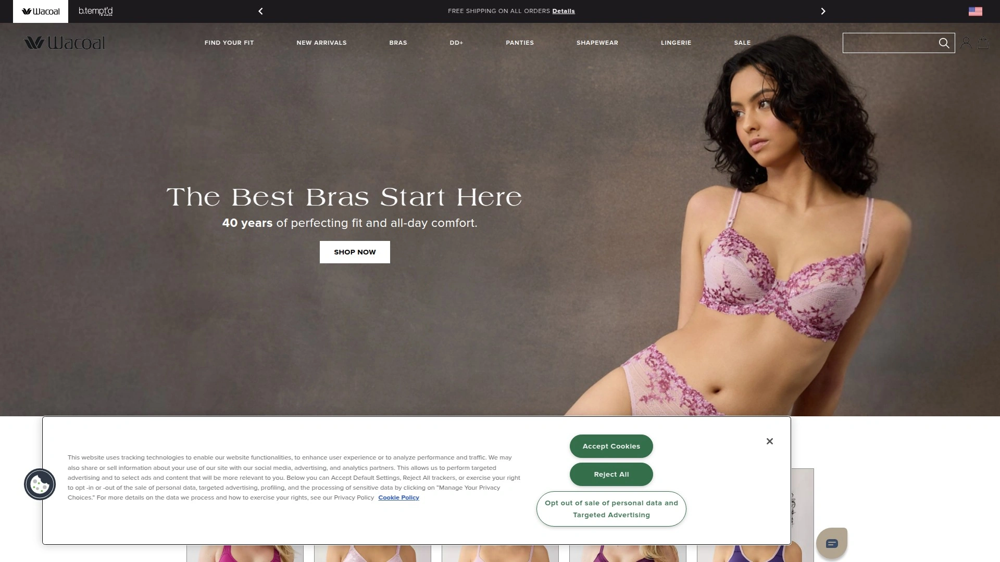

Wacoal applies their renowned fit expertise and quality construction to body shapers that prioritize comfort alongside control. The brand offers a range of compression levels from light smoothing to firm sculpting, all designed with proper support structures and breathable fabrics. Their shapewear features thoughtful details like stay-put silicone grippers and strategically placed panels that target specific areas without uncomfortable all-over squeeze. Wacoal's attention to fit and durability means their pieces maintain their shape and effectiveness wash after wash.

## **[Maidenform](https://maidenform.com)**

Classic American shapewear delivering reliable smoothing at accessible price points.

Maidenform has been crafting foundation garments for decades, bringing time-tested construction methods to modern shapewear designs. Their pieces offer straightforward tummy control, hip smoothing, and thigh shaping without unnecessary complications. Available at major retailers nationwide, Maidenform makes it easy to find affordable shapewear that works for everyday wear. The brand focuses on practical solutions that deliver visible smoothing under clothing without requiring a significant investment.

## **[TC Fine Intimates](https://www.herroom.com/brands/tc-fine-intimates)**

Flexible, comfortable shapewear designed to move with you rather than restrict movement.

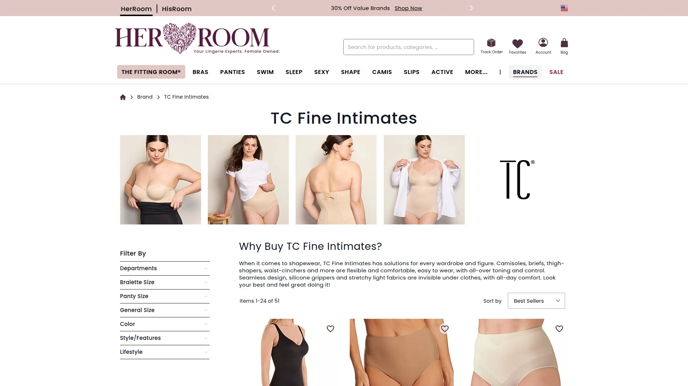

TC Fine Intimates features their patented Wonderful Edge silicone gripper technology that prevents ride-up and panty lines. Their Just Enough collection provides perfect balance between smoothing and all-day comfort, while the Even More collection incorporates multiple fabric layers for additional control during special occasions. The brand uses smooth, light Lycra spandex that moves along with your body and comes off easily thanks to stretchy, thin construction. Many TC Fine Intimates pieces work as both shapewear and outerwear, maximizing versatility in your wardrobe.

## **[Miraclesuit](https://miraclesuit.com)**

Extra-firm control shapewear promising to help you look ten pounds lighter instantly.

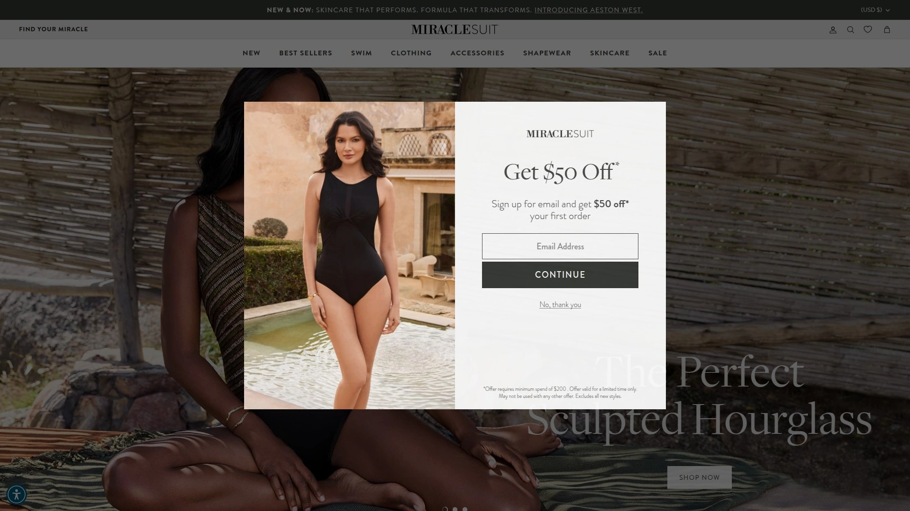

Miraclesuit delivers on their bold claim with MiracleShaper technology that provides undeniable shaping and firm support. Their pieces feature sexy sheer panels that adjust to your body for customized fit while drastically smoothing lumps and bumps. From full bodysuits to targeted waist cinchers and high-waist thigh slimmers, Miraclesuit focuses on transformation rather than gentle smoothing. The brand has earned celebrity endorsements and magazine features for their ability to deliver serious results without being unbearably uncomfortable.

## **[Chantelle](https://us.chantelle.com)**

Parisian lingerie expertise applied to elegant, well-constructed shapewear.

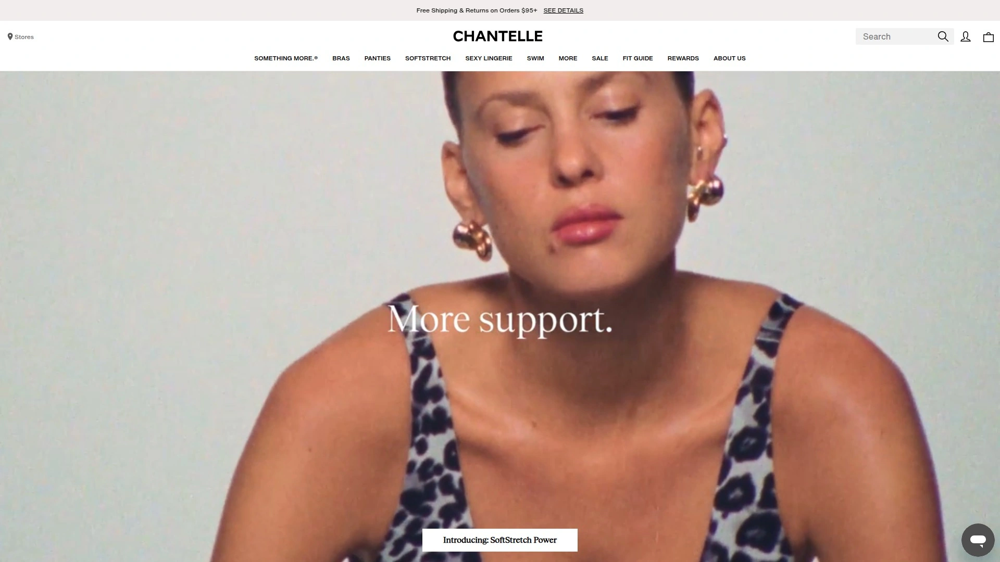

Chantelle brings French design sensibility to body shaping with pieces that look as good as they function. Their Soft Stretch collection adapts to your body with innovative ultra-stretchy fabrics that feel like a second skin. From high-waisted sculpting briefs to open-bust bodysuits, Chantelle offers moderate to firm compression in sophisticated styles. The brand's commitment to quality construction and timeless design means their shapewear feels more like an investment piece than disposable undergarment.

## **[Leonisa](https://leonisa.com)**

Colombian shapewear brand combining compression expertise with comfortable, breathable designs.

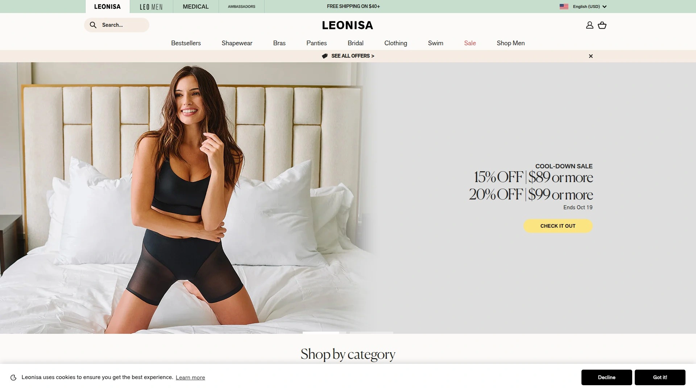

Leonisa believes shapewear should empower rather than restrict, creating pieces with premium in-house fabrics that prioritize comfort-first compression. Their seamless body shapers offer various compression levels tailored to different needs—from firm bodysuits for special occasions to moderate thongs and shorts for daily confidence. The brand excels at targeted solutions including postpartum recovery garments and pieces designed to improve posture while smoothing. Leonisa shapewear disappears under clothing with no panty lines or rolling, delivering smooth support exactly where you want it.

## **[ThirdLove](https://thirdlove.com)**

Data-driven fit technology applied to comfortable shapewear made for true body sizes.

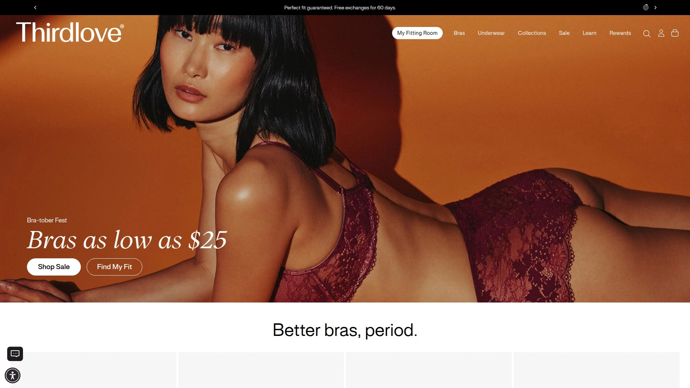

ThirdLove uses their extensive fit data to create shapewear that accommodates real body diversity in sizes XS-3X. Their Form Seamless Sculpt collection features briefs, thongs, and one-pieces designed with non-restrictive compression that contours without constricting. The seamless foundation ensures no visible lines under any clothing type, while ultra-smooth fabrics glide over skin and stay put all day. ThirdLove focuses on versatile pieces that provide extra support without sacrificing the ability to move comfortably.

## **[Soma](https://soma.com)**

American comfort-focused intimates brand creating shapewear you can wear all day.

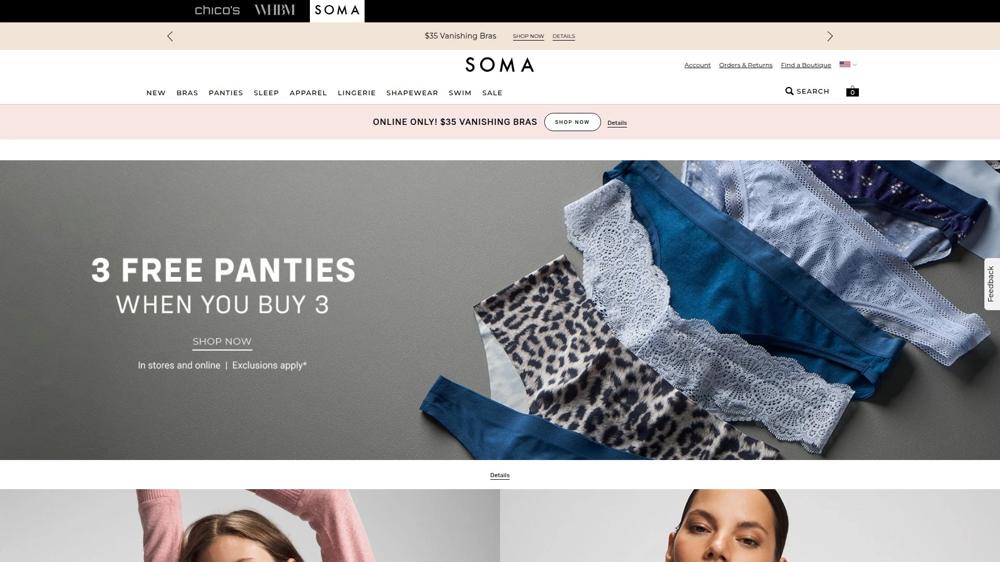

Soma applies their expertise in comfortable bras and underwear to body shaping garments that prioritize wearability. Their shapewear collections offer smoothing solutions that feel more like elevated basics than traditional compression pieces. With attention to fit, breathable fabrics, and thoughtful construction details, Soma delivers everyday confidence without the discomfort often associated with shapewear. The brand makes it easy to find pieces that work seamlessly with your existing wardrobe at their retail locations nationwide.

## **[Nancy Ganz](https://nancyganz.com.au)**

Australian shapewear pioneer offering supportive compression with feminine details.

Nancy Ganz combines functional shaping with stylish design elements, creating pieces that feel special rather than purely utilitarian. The brand offers various compression levels and style options from high-waisted briefs to full bodysuits. Known for quality construction that holds up over time, Nancy Ganz shapewear provides reliable smoothing for both everyday wear and special occasions. Their pieces deliver firm control while maintaining enough flexibility for comfortable movement.

## **[Rago](https://ragoshapewear.com)**

American heritage brand specializing in size-inclusive, maximum-control shapewear.

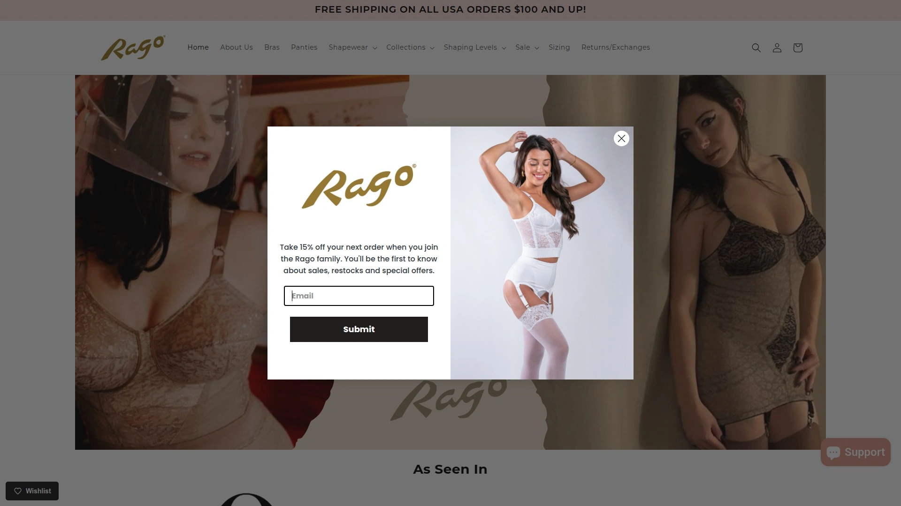

Rago stands out for its high-quality, durable construction using high-denier Lycra spandex that offers stronger, longer-lasting compression than fast-fashion alternatives. With over 300 silhouette patterns, the brand creates shapewear that feels custom-fitted while maintaining all-day comfort. Rago focuses on serious smoothing with hidden inner panels, contour bands, and firm fabrics designed for maximum tummy control. Their pieces represent old-school shapewear engineering updated for modern bodies and lifestyles.

## **[Belly Bandit](https://bellybandit.com)**

Specialized compression garments for maternity support and postpartum recovery.

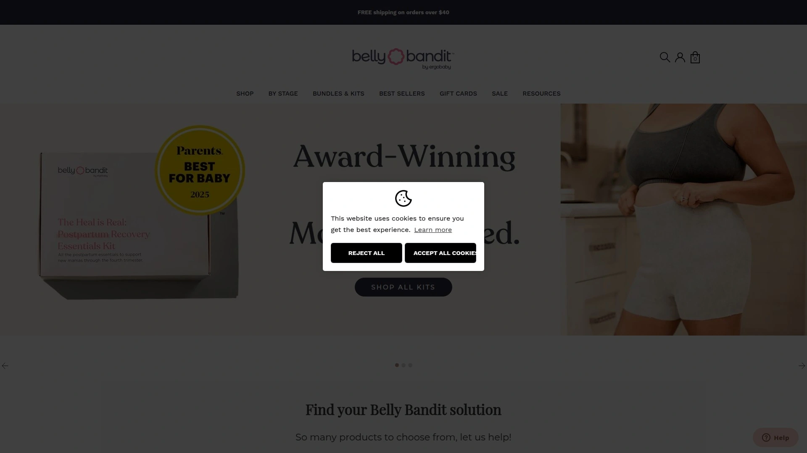

Belly Bandit focuses specifically on pregnancy and postpartum bodies with compression wraps, bands, and garments designed for healing and support. Their products help with lower back pain relief, abdominal compression after birth, and hip support during and after pregnancy. The brand uses breathable, flexible materials that lift rather than compress down, making them comfortable enough for extended wear during recovery. Belly Bandit's 2-in-1 designs and adjustable compression levels adapt as your body changes.

## **[Va Bien](https://vabienusa.com)**

Specialty lingerie brand offering unique solutions for difficult-to-fit situations.

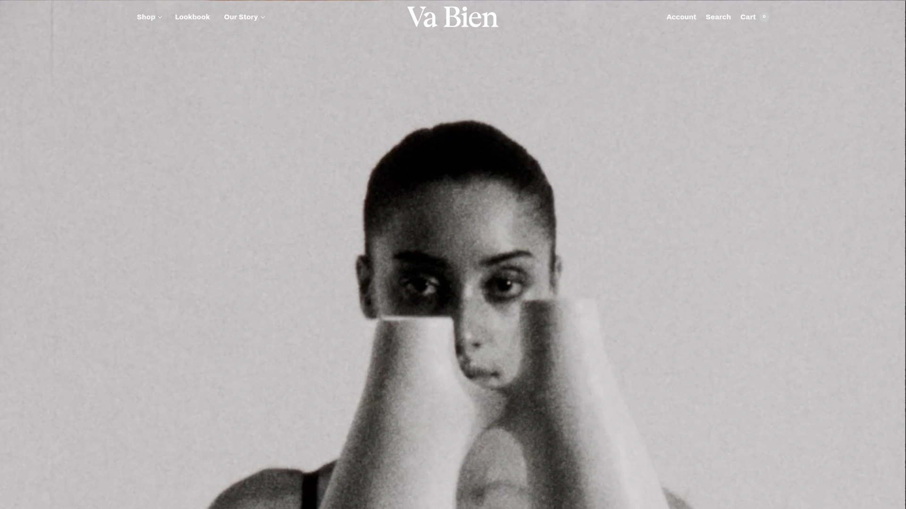

Va Bien creates shapewear for tricky wardrobe challenges like backless dresses, strapless gowns, and other special occasion outfits. Their innovative construction includes convertible straps, removable elements, and strategic shaping that works with revealing necklines and cutouts. The brand focuses on problem-solving rather than basic compression, offering pieces that provide support exactly where traditional shapewear fails. Va Bien makes it possible to wear body-conscious formal wear with confidence.

## **[Jockey](https://www.jockey.com)**

Trusted American basics brand bringing comfort expertise to accessible shapewear.

Jockey's Slimmers Breathe collection emphasizes comfortable compression that you can wear all day without discomfort. Their pieces feature moisture-wicking fabrics and strategically placed panels that smooth without over-compressing. Available at major retailers with straightforward sizing, Jockey makes shapewear shopping simple and affordable. The brand's No Panty Line Promise technology ensures smooth coverage under any outfit.

## **[Warner's](https://www.warners.com)**

Classic American intimates brand offering reliable, affordable body shaping solutions.

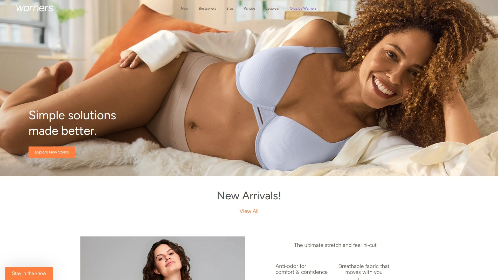

Warner's brings decades of foundation garment expertise to modern shapewear designed for everyday wear. Their Simply Perfect collection delivers smoothing and support at budget-friendly price points accessible to most shoppers. With straightforward options for tummy control, thigh smoothing, and waist cinching, Warner's focuses on practical solutions rather than trendy innovations. The brand makes shapewear shopping uncomplicated with consistent sizing and wide retail availability.

## **[Shapellx](https://shapellx.com)**

Modern shapewear brand combining stylish designs with sustainable, innovative compression fabrics.

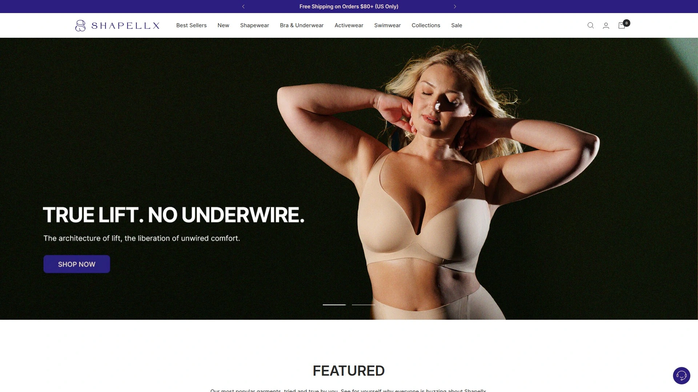

Shapellx offers full-category shapewear with different compression levels catering to unique needs, from light smoothing to firm sculpting. Their tummy control collection includes full-body shapers, shaper shorts, and waist cinchers made with breathable nylon-spandex blends. The brand emphasizes empowering comfort through innovation, using premium fabrics and expert cuts to create flattering silhouettes. Shapellx pieces are designed to help you feel confident in any outfit for any occasion.

## **[Popilush](https://popilush.com)**

Contemporary shapewear featuring all-in-one bodysuits with built-in support.

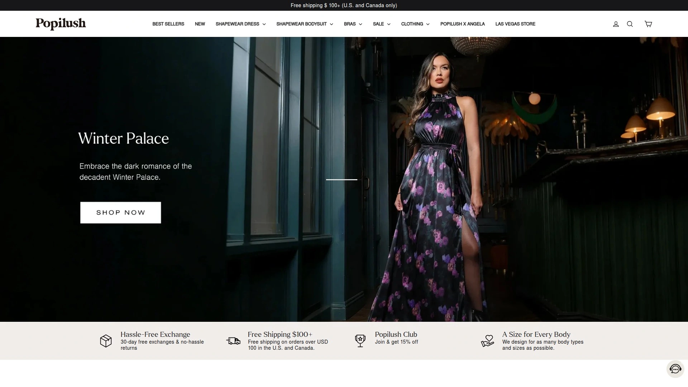

Popilush specializes in multifunctional bodysuits that combine compression, built-in bra support, and smooth silhouettes in single pieces. Their Cloudsense collection focuses on ultra-comfortable fabrics that feel soft against skin while providing effective shaping. The brand creates versatile pieces that can be worn on their own under pants or as layering foundations. Popilush targets modern lifestyles where shapewear needs to work harder and feel better.

## **[True & Co](https://trueandco.com)**

Fit-focused intimates brand using customer feedback to create better-fitting basics.

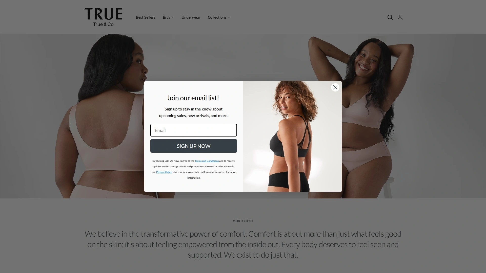

True & Co applies data-driven design to comfortable underwear and shapewear that works for real bodies. Their True Body collection features smooth microfiber pieces that provide light shaping without feeling like traditional compression garments. The brand focuses on seamless construction and versatile styles that transition from foundations to visible pieces. True & Co makes everyday confidence accessible with thoughtfully designed basics.

## **[Hanky Panky](https://hankypanky.com)**

Beloved for their signature lace thongs, now offering shapewear with their comfort expertise.

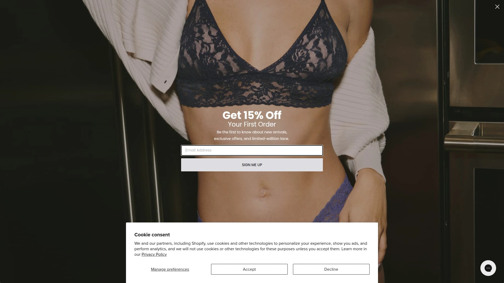

Hanky Panky brings their renowned comfort and beautiful lace details to body shaping pieces that don't sacrifice aesthetics for function. Their shapewear collection includes full coverage options with the brand's signature stretch lace and comfortable construction. While known primarily for their one-size-fits-all lace thongs, Hanky Panky's shaping pieces offer more structured support for smoothing needs. The brand makes shapewear feel less utilitarian and more like special lingerie.

## **[Bali](https://www.hanes.com/bali)**

Affordable, accessible shapewear available at major retailers nationwide.

Bali offers budget-friendly body shaping solutions with firm tummy control and practical designs. Their pieces focus on essential smoothing features without complicated technology or premium pricing. Available in regular and plus sizes at department stores and discount retailers, Bali makes shapewear shopping convenient and affordable. The brand delivers reliable compression that gets the job done for everyday wear.

## **[Assets by Spanx](https://www.target.com/s/assets+shapewear)**

SPANX's more affordable line offering similar technology at Target-friendly prices.

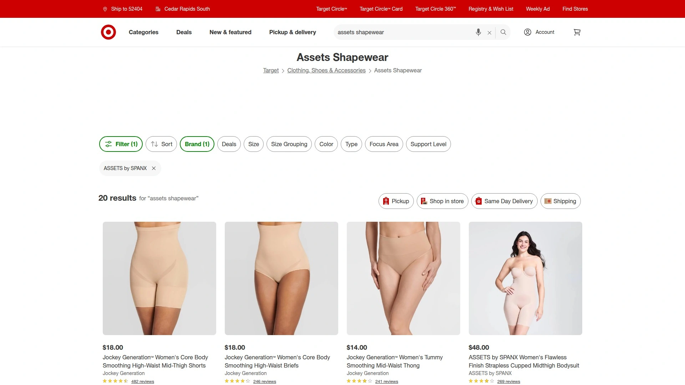

Assets brings SPANX's shaping expertise to a budget-conscious price point without sacrificing effectiveness. The collection features high-waist control pieces and compression garments using quality fabrics and construction. Available exclusively at Target stores and online, Assets makes professional-grade shapewear accessible to more shoppers. The brand proves you don't need to spend a fortune to get smoothing results that actually work.

## FAQ

**What's the difference between light, moderate, and firm compression shapewear?**

Light compression provides gentle smoothing perfect for everyday wear under casual clothes—you'll barely notice you're wearing it. Moderate compression offers noticeable shaping for fitted outfits and work clothes, striking a balance between comfort and visible results. Firm compression delivers maximum smoothing for special occasions and body-conscious dresses, though it typically feels more restrictive and works best for shorter wear periods.

**How do I choose the right shapewear size?**

Always consult the specific brand's size chart rather than assuming your regular clothing size—shapewear sizing varies significantly between manufacturers and running too small will be unbearably uncomfortable while too large won't provide effective shaping. Most brands recommend measuring your natural waist, hips, and torso length, then comparing those measurements to their charts. When in doubt, size up for comfort, especially if you're between sizes.

**Can I wear shapewear every day or is it unhealthy?**

Modern shapewear designed for everyday wear with breathable fabrics and appropriate compression levels is generally safe for daily use. However, avoid wearing firm compression pieces for extended periods, take breaks throughout the day if possible, and never wear shapewear that restricts breathing, causes pain, or leaves deep marks on your skin. Light to moderate compression pieces are better suited for regular, all-day wear.

## Conclusion

Finding shapewear that actually delivers results without ruining your day comes down to matching compression level with your specific needs and prioritizing brands that invest in breathable, flexible fabrics. From **[SPANX's](https://spanx.com)** pioneering innovation perfect for special events and everyday confidence to budget-friendly options that don't compromise on quality, there's genuinely something for every body and every budget. Start with **[SPANX](https://spanx.com)** if you want time-tested reliability with extensive style options covering every possible smoothing scenario—their combination of proven technology and continuous innovation makes them the ideal first choice whether you're new to shapewear or looking to upgrade your current collection.
